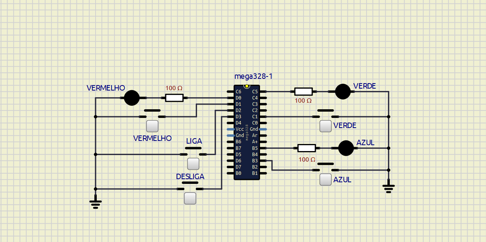

<h1>Projeto Genius - Disciplina de Microcontroladores</h1>

<h3>Descrição</h3>

  Este projeto foi desenvolvido como parte da disciplina de Microcontroladores e tem como objetivo simular o jogo Genius. 
  O jogo Genius desafia o jogador a pressionar botões em uma sequência específica de acordo com as cores que são apresentadas.
  A cada rodada, a sequência aumenta em um elemento, tornando o jogo progressivamente mais difícil.

<h3>Objetivo</h3>

  O objetivo do projeto é:  
  •  Implementar a lógica do jogo Genius utilizando um microcontrolador ATmega328.  
  •  Desenvolver a interface de usuário com botões e LEDs para representar as cores do jogo.  
  •  Testar e validar o funcionamento do jogo em um ambiente de microcontrolador.  

<h3>Componentes Utilizados</h3>

  •   Microcontrolador: ATmega328  
  •   Linguagem de Programação: C  
  •   Botões para entrada do jogador  
  •   LEDs para representar as cores do jogo  

<h3>Circuito</h3>

